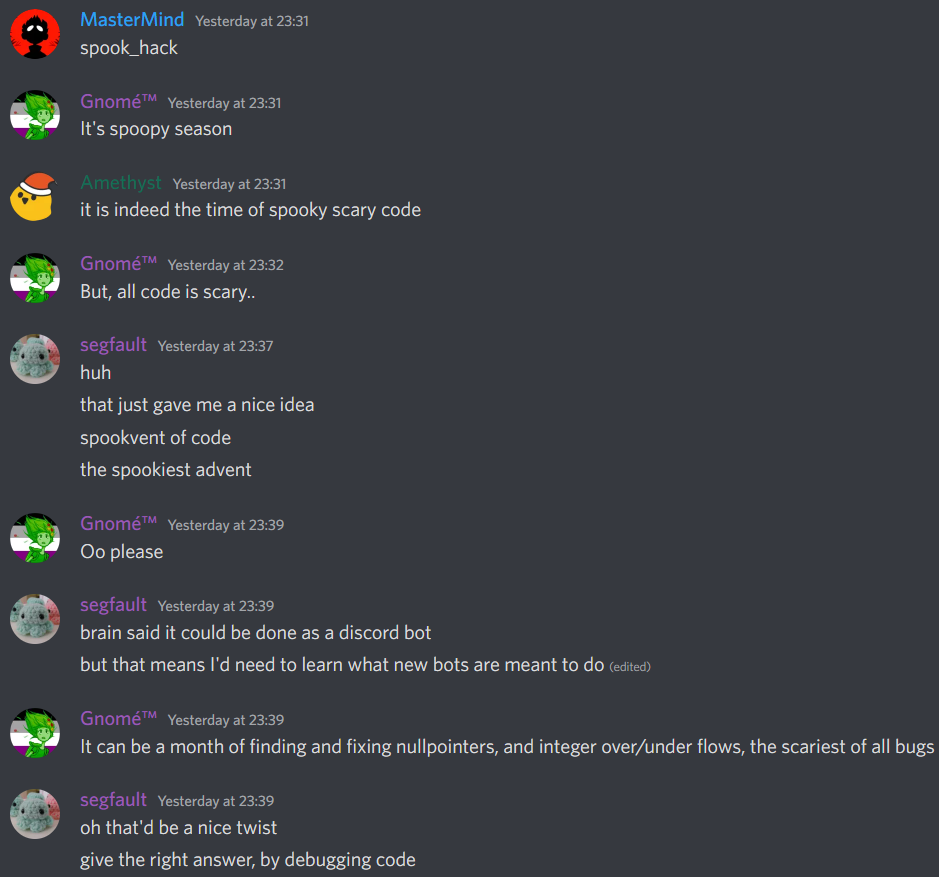

# Herald of Code

A Discord Bot for setting up your own [Advent of Code](https://adventofcode.com) styled events!



The plan is to not need any scheduling or anything. So long as a problem is available, then if it's on/after the day that problem unlocks (default, consecutive days), that problem can be attempted (and its description can be shared). Multiple-stage problems will be handled later, probably at first by just setting up nested tables that get done in sequence, or by starting to do a branching paths approach later; much later, if we still want this, just thought it might be interesting for bigger events, though that might be branching paths rather than consecutive problems.

Users will use modern discord interactions and `/<command>` or such to request the problem description (just for them, not visible to anyone else) and their personal input (again, not visible to anyone else), and then be able to post their outputs (only visible when they got it correct, alongside their leaderboard position on this problem and for the event). They can also ask for the leaderboard in general, both for a problem and for an entire event. Past problems will be available, and events can be set to either unlock all problems at the start ("freestyle", like Project Euler) or (by default) unlock all at the end (so people can skip to the harder ones). Prior to this, you only unlock at the rate of completion, or when the problem is available, whichever comes later.

If Discord lets us present a menu, then we're able to populate that with the current events and problems, depending on what was asked for. When only one event is ongoing, we assume that one when asking for the problems, otherwise we show all events with their most-recently unlocked problem. Picking one will provide the description and input for said problem. Or they can look at the menu of past or freestyle events for them to pick from. For paginated problems, make sure to offer immediate "continue" or "start" options, and since it'll start from the most recent, offer a "skip to oldest" page, similarly with menu of events (showing the most recently updated first).

The bot should be provided a default category (such as `💾 coding-events`) to work within. Users will interact with the bot from this category. When an event starts, a Forum channel (such as `#swacktober-2022`) for it will be opened, and each problem will get a thread in that channel. The problem will have its difficulty displayed with a tag of 0-9. A special (pinned) `#leaderboard` thread will also be created, expressly for people to check the overall event leaderboard. Problem channels and leaderboard channels have separate tags, and problems may have category tags for their type, to make searching and identifying easier. In addition to the Forum channels for each event, there is an optional `#global-leaderboard` text channel that can be used, which will display aggregate scores (and statistics?) over all previous and ongoing events. An admin-only `#logging` channel also exists, providing error warnings. The bot can also be pointed at a default role (such as `@Coders`) which it can use to ping people for new events, and/or it can setup Discord Events if you're counting down to it starting, and will remain during the usage of --- this is useful if you're wanting a voice channel open alongside it. If the event coordinators don't want the event to remain open or unlock after a given time, then it can be locked accordingly, rather than deleted.

Ideally, in the long term, integration with existing platforms like Advent of Code or Project Euler would be nice, but I'll leave that for others; it's probably more work than I can afford at this time. Until then, the bot will accept "blank" problems, where it is just the description with no input/output generation/checking, which lets the coordinator just have it point a link elsewhere, so you get the structure but for events where you're not actually hosting it yourself (such as Google Hash Code or Advent of Code).

While we may have standard AoC style problems with just a description and examples, we'll also have "scary code" problems where you must debug example code to get the right output. For the sake of people, we'll provide difficulty ratings, and by default we'll unlock from lowest to highest (on consecutive days).

Different events or stand-alone problems will be different TOML files in `./problems/`, such as `./problems/swacktober-2022.toml`.

Users will have all their secret inputs and expected outputs per problem as TOML files in `./users/<user>.toml`, no other information should need to be stored. Since this uses their Discord UUID it will be resistant to username changes, though we'll need a way to sync/rename for new accounts (such as if someone got hacked) --- not a high priority, but it'd probably come up eventually.

In the AoC format, each person gets some secret, personal input for a problem. This either modifies it somehow, or provides the input to be run through the program.

The bot is configured with a `setup.toml` file, which expects something of the format:
```toml
token = "ABCDEFGHIJKLMNOPQRST123"
servers = [1234567890]
```

While servers is a list, please only put the one in. Yes, it's plural, and yes, you can put more in. Please don't. As the code is, it'll probably break, since that's not something I've tested. Feel free to fork/PR it.

I'm not fussed, so like SwackQuote, this will be something you're expected to run yourself, so have a separate bot per server. Sorry, I just don't need anything more complicated, but if you'd like to improve, feel free to fork/PR it. Having per-server `./<server>/problems/` & `./<server>/users/` directories is a clean approach, if you want my recommendation.
