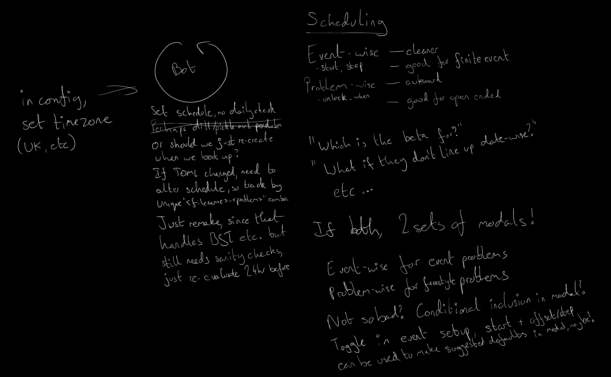

# Herald of Code

A Discord Bot for setting up your own [Advent of Code](https://adventofcode.com) styled events!

The Discussions page has been disabled, as GitHub does not enable appropriate moderation tools to ensure safe discourse.


Users will use modern discord interactions and slash commands (`/help`) in a problem's thread to request the problem description (just for them, not visible to anyone else) and their personal input (again, not visible to anyone else), and then be able to post their outputs (only visible when they got it correct, alongside their leaderboard position on this problem and for the event). They can also ask for the leaderboard in general, both for a problem and for an entire event. Unlocked problems will be freely available, no "you must first solve day 1 to start day 2", and events can be set to either unlock all problems at the start ("freestyle", like Project Euler) or (by default) unlock as they go (so people can choose). Before this, you only unlock at the rate of completion, or when the problem is available, whichever comes later.


The bot should be provided a default category (such as `💾 coding-events`) to work within. Users will interact with the bot from this category. When an event starts, a Forum channel (such as `#swacktober-2022`) for it will be opened, and each problem will get a thread in that channel. The problem will have its difficulty displayed with a tag of 0-9. A special (pinned) `#leaderboard` thread will also be created, expressly for people to check the overall event leaderboard. Problem channels and leaderboard channels have separate tags, and problems may have category tags for their type, to make searching and identifying easier. In addition to the Forum channels for each event, there is an optional `#global-leaderboard` text channel that can be used, which will display aggregate scores (and statistics?) over all previous and ongoing events. An admin-only `#logging` channel also exists, providing error warnings. The bot can also be pointed at a default role (such as `@Coders`) which it can use to ping people for new events, and/or it can set up Discord Events if you're counting down to it starting, and will remain during the usage of --- this is useful if you want a voice channel open alongside it. If the event coordinators don't want the event to remain open or unlock after a given time, then it can be locked accordingly, rather than deleted. Beta testing phases can be done before the problem goes live, just without scoring or leaderboards, either for the entire event (say a month before a month-long one) or per problem.

`@Coding-Coordinator` are allowed to set up events and make problems, etc, and by default can beta-test them. `@Coding-Testers` are just beta-testers. `@Coding-Archivalists` can see "archived" (not-default visible) events, such as from previous years (perhaps moved under a `💾 coding-archive` category if desired).

Ideally, in the long term, integration with existing platforms like Advent of Code or Project Euler would be nice, but I'll leave that for others; it's probably more work than I can afford at this time. Until then, the bot will accept "blank" problems, where it is just the description with no input/output generation/checking, which lets the co-ordinator just have it point a link elsewhere, so you get the structure but for events where you're not actually hosting it yourself (such as Google Hash Code or Advent of Code).

While we may have standard Advent style problems with just a description and examples, we'll also have "scary code" problems where you must debug example code to get the right output. For the sake of people, we'll provide difficulty ratings, and by default we'll unlock from lowest to highest (on consecutive days).

For each Forum, they may fit a certain "class" which is the kind of tag they will provide for problems. `Scary Code` gives `Use after free`, `Memory error`, `Arithmetic error`, etc. while `Solve Code` gives `Combinatorics`, `Grids`, `Bots`, `Scheduling`, etc. as pleased. We'll probably just bake them in, and when you assign tags to the problem, you can always just add more manually to the forum and problems (if you've added it to the forum, then the bot can most likely find and add it by the same `["Tag name", "Tag name", ...]` method as for adding normal tags).


Different events or stand-alone problems will be different TOML files in `./problems/`, such as `./problems/swacktober-2022.toml`.

Users will have all their secret inputs and expected outputs per problem as TOML files in `./users/<user>.toml`, no other information should need to be stored. Since this uses their Discord UUID it will be resistant to username changes, though we'll need a way to sync/rename for new accounts (such as if someone got hacked) --- not a high priority, but it'd probably come up eventually.

In the Advent format, each person gets some secret, personal input for a problem. This either modifies it somehow, or provides the input to be run through the program. Blank/Redirected problems just provide a URL to where the problem is, and does not accept solutions here. Leaderboard integration is a stretch goal, where possible, or to be added as desired, just fork/PR it.



A `@Coding-Coordinator` can create an event, setting the name, starting date, time between problems (days or hours, or `0` for open-ended), and whether there's a beta period in which problems unlock early for testers. Problems will have their fields, name, description, order (numeric), and a code snippet (python, probably) that is used to generate `(input,output)` pairs for users; if they give `(input,None)`, then we do not accept attempts for that problem, so `input` is likely a URL to a website). If the event is open-ended / freestyle, then the problem can be given an unlock date and beta period, but this is otherwise not included.

So long as a problem is available, then if it's on/after the day that problem unlocks (default, consecutive days), that problem can be attempted (and its description can be shared). Multiple-stage problems will be handled later, probably at first, by just setting up nested tables that are done in sequence. But, this is for later, if we still want this, just thought it might be useful for bigger Advent of Code style events.

---

## Setup

The bot is configured with a `setup.toml` file, which expects something of the format:
```toml
token = "ABCDEFGHIJKLMNOPQRST123"
servers = [1234567890]
```

While servers is a list, please only put the one in. Yes, it's plural, and yes, you can put more in. Please don't. As the code is, it'd probably break, since that's not something I've tested. You are welcome to fork/PR it.

I'm not fussed, so like Swack Quote, this will be something you're expected to run yourself, so have a separate bot per server. Sorry, I just don't need anything more complicated, but if you'd like to improve, feel free to fork/PR it. Having per-server `./<server>/problems/` & `./<server>/users/` directories is a clean approach if you want my recommendation.
